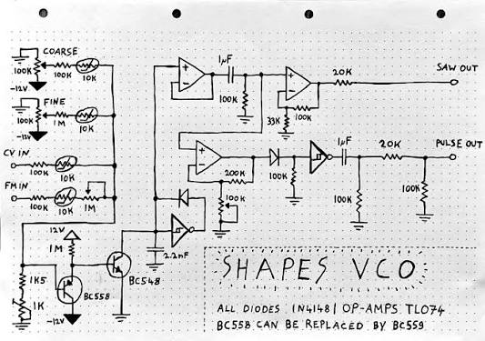
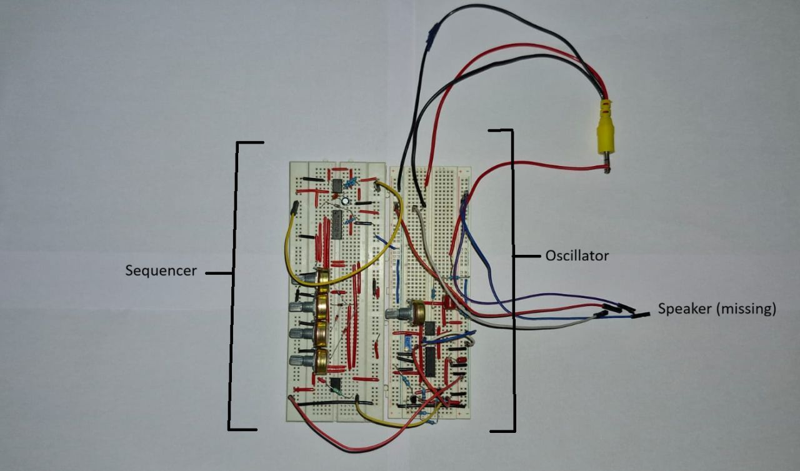
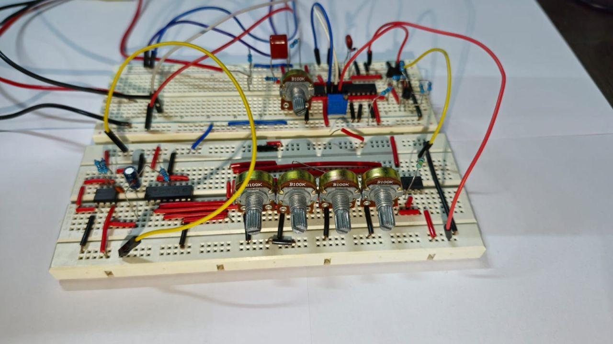

# Analog Schmitt-Trigger VCO with 4-Step Pitch Sequencer

A discrete and CMOS analog voltage-controlled oscillator built around a Schmitt-trigger relaxation core, an NPN exponential converter for 1V/oct tracking, a PNP and NTC thermal compensation stage, an output buffer, and a CD4017-based 4-step pitch sequencer. Built on breadboard using the design methodology of Moritz Klein's "Shapes VCO" and EDU DIY VCO circuit.

<p align="center">
  <em>Fig. 1. Full two-board breadboard build: The sequencer step pots on the left, oscillator core bottom right.</em>
</p>


---

## 1. Overview

This project followed the same signal-chain progression as Moritz Klein's build videos:

1. **Schmitt-trigger oscillator core**: a relaxation oscillator built around a Schmitt-trigger inverter, an RC timing network, and coarse and fine tuning pots.
2. **NPN transistor**: replaces the timing resistor to turn linear RC charge and discharge into an exponential response for control voltage tracking.
3. **Output buffer**: isolates the timing node from downstream loading.
4. **PNP and NTC thermal coupling**: compensates for temperature drift in the exponential converter transistor.
5. **4-step sequencer**: a CD4017 decade counter walks a 555-timer clock through 4 steps, each with its own potentiometer feeding a CV into the VCO.

Target tuning point: **7.12 kHz** (coarse-tune reference frequency for the oscillator core).

---

## 2. Signal Chain

```
[Coarse/Fine/CV/FM pots] > [RC timing node] > [Schmitt-trigger core] > [NPN exp. converter]
        ^                                                                      |
   [PNP + NTC thermal compensation] <------------------------------------------+
                                              |
                                              v
                                     [Output buffer]
                                              |
                                              v
                                        VCO OUT (audio)

[555 clock] > [CD4017 decade counter] > [4x step pot] > CV into VCO's CV IN
```

---

## 3. Bill of Materials

### VCO Core

| Part | Value | Qty |
|---|---|---|
| Potentiometer | 100k | 5 |
| Resistor | 1k | 5 |
| Resistor | 1.5k | 1 |
| Resistor | 20k | 3 |
| Resistor | 33k | 1 |
| Resistor | 100k | 10 |
| Resistor | 200k | 5 |
| Resistor | 1M | 5 |
| Capacitor (Film/Foil) | 2.2n | 2 |
| Capacitor (Film/Foil) | 1u | 2 |
| Capacitor (Ceramic) | 100n | 1 |
| Capacitor (Electrolytic) | 220u | 1 |
| Op-Amp | TL074/TL072 | 2 |
| Transistor (PNP) | BC558 | 1 |
| Transistor (NPN) | BC548 | 1 |
| Diode (Small Signal) | 1N4148 | 3 |
| Schmitt Trigger | CD40106 | 2 |
| NTC Thermistor | 10k | 3 |
| Trimmer | 1k | 1 |
| Amplifier | LM386 | 1 |
| Jack Socket | n/a | 1 |
| Battery + clip | 9V | 2 |
| Speaker | n/a | optional |

### Sequencer

| Part | Value | Qty |
|---|---|---|
| Decade Counter | CD4017 | 1 |
| Transistor (NPN) | BC548 | 5 |
| LED | any | 5 |
| Potentiometer | 100k | 5 |
| Op-Amp | TL074 | 1 |
| Trimmer | 5k | 1 |
| Diode | 1N4148 | 13 |
| Resistor | 100k | 10 |
| Resistor | 68k | 1 |
| Resistor | 51k | 1 |
| Resistor | 1k | 7 |
| 555 Timer | n/a (clock source) | 1 |
| Jack Socket | n/a | 3 |

---

## 4. Component Value Estimation

### 4.1 Oscillator core, target 7.12 kHz

A Schmitt-trigger RC relaxation oscillator frequency formula is approximately:

```
f = 1 / (k * R * C)
```

With the schematic's **C = 2.2 nF**, solving for R at **f = 7.12 kHz**:

| k | R for 7.12 kHz |
|---|---|
| 0.7 | approx. 91.2 kOhm |
| 1.0 (best estimate) | **approx. 63.8 kOhm** |
| 1.4 | approx. 45.6 kOhm |

**Best single estimate: R is approximately 63.8 kOhm**, taking k = 1.0 as the average for this gate family:

```
R = 1 / (f * C) = 1 / (7,120 Hz x 2.2nF) = approx. 63.8 kOhm
```

The coarse pot (100k) sits in series with the 10k fine trim. Landing on approximately 63.8 kOhm means the coarse pot needs to be set to roughly 54 kOhm (about 54% rotation).

### 4.2 Sequencer clock (555 timer)

Using parts in the stock, **R1 = 1k**, **R2 = 68k in series with a 0 to 100k pot**, plus an added **C of approximately 1uF**:

| Pot position | R2 total | Frequency | Steps/min |
|---|---|---|---|
| Fully CCW (0k) | 68k | approx. 10.5 Hz | approx. 630 |
| Fully CW (100k) | 168k | approx. 4.3 Hz | approx. 258 |

---

## 5. Build Media

<p align="center">
  
</p>
<p align="center">
  <em>Fig. 2.  Reference "Shapes VCO" schematic used as the design basis.</em>
</p>

<p align="center">
  
</p>

<p align="center">
  
</p>
<p align="center">
  <em>Fig. 3. Angled view of the full two-board build showing 4-step CV potentiometers and core logic.</em>
</p>


### Demo Video
[Watch the VCO and Sequencer Demo on Google Drive](https://drive.google.com/file/d/1yXxklhQKPN-tiU9zWu6JRz8YAkXaJKhT/view?usp=sharing)
---

## 6. Key Learnings

- **CMOS Schmitt oscillators lack a single fixed formula.** Hysteresis varies chip to chip, requiring pots and trimmers instead of precision fixed resistors.
- **Exponential tracking is a calibration problem.** The NPN converter slope requires empirical trimming against a reference CV.
- **Thermal compensation is essential.** Without the PNP and NTC stage, tracking drifts as the transistor warms up.
- **Partial builds prove concepts.** Skipping the wave shaping stage still yields a working 4-step oscillator to validate core design.

---

## 7. What's Next

- Populate the remaining op-amp shaping stage (saw and pulse outputs) from the reference schematic.
- Add Pulse Width Modulation for better control.
- Add an envelope generator for a metallic sound.
- Move from breadboard to stripboard or PCB once the full chain is verified.
- Extend the sequencer beyond 4 steps if a second CD4017 or additional decoding is added later.

---

## Credits

Design methodology and reference schematic: **Moritz Klein** ("Shapes VCO" and EDU DIY VCO design series).
